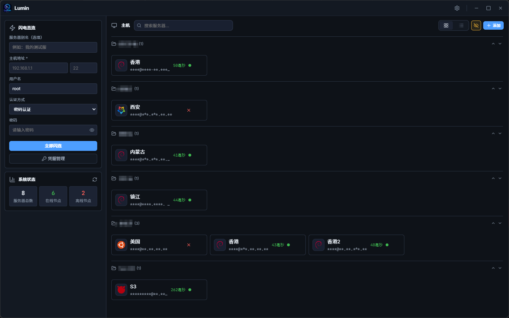
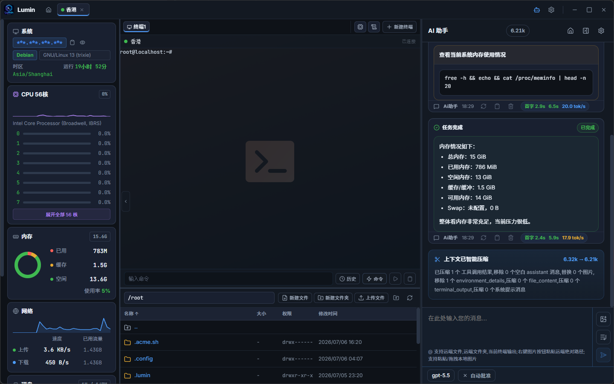

<div align="center">

# Lumin

**Lightweight, cross-platform SSH client for developers**

[](https://github.com/wmwlwmwl/Lumin-SSH/releases)
[](https://github.com/wmwlwmwl/Lumin-SSH/releases)
[](LICENSE)

[English](./README_EN.md) · [简体中文](./README.md)

</div>

---

## About

Lumin is a desktop SSH client for developers and system administrators. Built with Go-native concurrency + WebSocket + xterm.js, it delivers sub-millisecond terminal responsiveness. Packed with system resource probes, remote file manager, command history, cloud-synced encrypted backups, and AI agent (MCP) integration — no server-side agent required.

<div align="center">
  
  <br /><br />
  
</div>

---

## Features

### Terminal & Connection
- **Async PTY Engine** — Go-native concurrent I/O on the backend, WebSocket + xterm.js for ultra-low latency
- **Predictive Local Echo** — Buttery-smooth typing even on high-latency connections
- **Multi-Terminal Tabs** — Open multiple terminal tabs within a single SSH session, each independently closable
- **Session Management** — Manage multiple SSH sessions simultaneously; right-click tab context menu (disconnect / close / reconnect)
- **Sensitive Info Toggle** — One-click hide/show passwords, private keys

### Dashboard & Quick Connect
- **Quick Connect** — Enter host, port, user, password/key and connect instantly — no pre-configuration needed
- **Grid/Table Views** — Toggle between card grid and table layout
- **Search & Filter** — Real-time search by server name, host, tags
- **Smart Latency Detection** — **SSH Banner RTT** (proxy-aware, recommended with Clash/V2Ray) and **TCP Dial** protocols
- **Configurable Ping Interval** — Auto-refresh interval for latency checks
- **Tab Overflow Dropdown** — Excess server tabs collapse into a searchable dropdown list

### Server Management
- **Auto-Save** — Quick-connected servers are automatically saved after successful connection
- **Clone Server** — Right-click to clone any server with all configuration (passwords, keys included)
- **Import/Export** — The host list toolbar's data management entry lets you export all connections (and referenced credentials) as **plaintext JSON** or **encrypted .enc**; encrypted export can reuse the configured cloud sync key (zero interaction) or a custom password; import auto-detects plaintext/encrypted, auto-tries cloud sync keys for encrypted files, and prompts for password on failure; supports importing cloud backup `.enc` files directly; provides an import template download for easy batch entry and cross-machine migration
- **Duplicate Detection** — Detects host+port+username duplicates on add/edit/clone/quick connect
- **Group Management** — Organize servers into groups, move between groups, filter by group
- **OS Icon Recognition** — Auto-detects 30+ OS types with rich icon set
- **Credential Management** — Centralized reusable credentials (password/key) that auto-update across all referencing servers

### System Resource Probe
- **Zero Agent Deployment** — Auto-mounts monitoring panel on connection — no agent installation needed
- **Real-Time Metrics** — Per-core CPU chart, memory donut, network throughput line chart, disk I/O, partition usage
- **GPU & RAID Support** — Additional GPU and RAID info queries
- **Process Management** — Real-time process viewer with search, sort, signal send
- **Network Monitor Details** — View active connections, traffic stats, and network breakdowns
- **Configurable Refresh Interval** — Adjustable in Settings

### Remote File Manager
- **Full File Operations** — Browse, upload, download, delete, rename, create directories/files
- **Built-in Code Editor** — Edit remote files directly with syntax highlighting (up to 5MB)
- **Compress/Extract** — tar.gz / zip support
- **Compressed Transfer** — Multi-file uploads packed locally as tar.gz, auto-extracted on the remote side
- **Permission Editing (chmod)** — Visual permission editor with octal mode
- **Drag-and-Drop Upload** — Drop files from local directly onto the panel
- **Copy Path** — Right-click any file or folder to copy the full remote path
- **Three Layout Modes** — Tab, right split, bottom split

### Command History & Quick Commands
- **Auto-Capture** — Every command executed in the terminal is automatically saved per-server
- **Search & Replay** — Search history per-server or globally, one-click replay
- **Quick Commands Library** — Group-managed command snippets, send to current or all sessions
- **Dynamic Parameters** — Insert `p#` placeholders for runtime prompts

### Credential Management
- **Centralized Auth** — Create reusable credential groups (password/private key) and reference them across servers
- **Auto-Sync Updates** — Editing a credential automatically updates all referencing servers
- **Passphrase Support** — Optional passphrase for private key credentials

### AI Chat & Agent Integration
- **Built-in AI Chat Panel** — In-app AI chat interface with multi-turn conversations, message edit/retry, streaming output, and reasoning trace display
- **Multi-Provider Support** — Compatible with OpenAI API formats (Compatible / Messages / Responses protocols), freely switch between providers
- **Slash Commands & @Mentions** — Type `/` to trigger custom commands, type `@` to reference terminal output or remote files/directories
- **Tool Approval & Execution** — Approval cards for AI tool calls, approve/reject individually, configurable auto-approve (read/write/execute)
- **Smart Context Compression** — One-click token compression when conversations grow long
- **Built-in MCP Server** — Toggleable Streamable HTTP MCP server in AI panel settings, exposing SSH session access to AI tools
- **AI Agent Panel** — In-session panel showing MCP server URL, available tools list, and connection guide
- **Visibility Control** — Toggle AI panel on/off in Settings (default: off)
- **Terminal Isolation** — Create independent AI panels and runtime sessions per terminal
- **AI Command Terminal Assignment** — Assign chat commands to specific terminals with candidate status and readiness indicators
- **Terminal Output Limits** — Configurable max lines and characters for MCP terminal reads
- **Zero-Config Setup** — AI editors (Windsurf, Cursor, VS Code + Copilot, etc.) connect via standard MCP client config

### Cloud Sync (WebDAV / R2 / FTP / SFTP)
- **Four Cloud Storage Backends** — **WebDAV**, **Cloudflare R2 (S3-compatible)**, **FTP**, **SFTP**
- **AES-256-GCM Encryption** — Every config change auto-encrypts a snapshot before upload
- **One-Click Restore** — Configure the same backend on a new machine and restore all servers instantly
- **Auto-Sync Mode** — Configurable startup merge strategy
- **Backup Retention** — Configurable max backup count

### Local Encryption
- Generates a unique 32-byte AES key on first run
- All passwords, private keys, and tokens are AES-GCM encrypted before hitting disk

### Auto Update
- Checks GitHub Releases on startup (2.5s delay, non-blocking)
- Manual check in Settings
- Real-time download progress with SHA256 checksum verification
- Hot-swap executable and auto-restart on success

### System Tray
- Window close behavior: **minimize to tray**, **quit**, or **ask every time**
- Single-instance enforcement — double launch re-activates existing window
- Left-click tray to show window, right-click for context menu

### Operation Confirmation & Security
- **Confirmation Dialogs** — Close connection, close all, close window all support secondary confirmation
- **"Don't Ask Again" Option** — Per-action skip with independent toggles in Settings
- **Host Key Verification** — First-connect fingerprint check + change detection for MITM protection
- **Concurrent Connection Progress** — Visual progress cards supporting multiple simultaneous connections

### Visual & Themes
- **Dark/Light Themes** — System-follow auto-switching
- **Minimal Compact UI** — Neutral blue-gray surfaces with unified buttons, tabs, tables, and modals
- **Custom Accent Colors** — 10 preset color options
- **4 Terminal Color Themes** — Lumin Default, Tokyo Night, Catppuccin, Dracula
- **Custom Terminal Wallpaper** — Upload background images with adjustable opacity
- **Lightweight Motion** — Restrained transitions for menus, modals, and state changes without heavy decorative effects
- **Toast Notifications** — Non-intrusive compact toast messages

### Layout & Splits
- **Left/Bottom Split** — Two split modes, freely resizable via drag
- **Adjustable Probe Panel Width** — Monitor sidebar width adjustable
- **Adjustable AI Panel Width** — AI agent panel width adjustable
- **Persistent Layout** — All layout preferences saved to local storage

### Shortcuts & Personalization
- **Customizable Shortcuts** — Copy, paste, clear, new tab, SIGINT, EOF, SIGTSTP, clear input — all rebindable
- **Terminal Font Size** — Slider-based real-time adjustment
- **Terminal Local Echo** — Disable echo for sensitive input
- **Internationalization** — 简体中文 / English toggle

### Workspace Memory
- **Remember Window Size** — Auto-restores the last window size and maximized state on startup
- **Remember Session Layout** — Optionally auto-restores last connections, terminal tabs, and split layout
- **Adaptive Screen** — Adjusts initial window size based on screen resolution (10% margin)

---

## Quick Start

### First Run
1. Download the latest `Lumin.exe` from [Releases](https://github.com/wmwlwmwl/Lumin-SSH/releases)
2. Run the executable — config directory is auto-created at `%APPDATA%\Lumin\config\`
3. Click **Quick Connect** on Dashboard to enter host, port, username, and password/key — automatically saved to server list after connection
4. Or click **Add Server** to open the full form with additional configuration options

### Daily Workflow
- **Connect** — Double-click a server card or right-click → Connect
- **Multi-Tab Terminal** — Click `+` in the tab bar to open additional terminals within a session
- **System Probe** — Click the **Probe** sidebar panel to view real-time CPU, memory, disk, and network metrics
- **File Manager** — Click the **Files** sidebar to browse, upload, download, edit remote files
- **Quick Commands** — Save frequently used commands in Settings → Quick Commands for one-click execution
- **Clone Server** — Right-click any server → Clone to duplicate all configuration including passwords/keys
- **Credential Management** — Create reusable credentials in Dashboard → Credential Management, reference them across multiple servers

---

## Configuration & Data

### Data Storage Location

On first run, Lumin creates `Lumin/config/` under the user config directory:

| Platform | Path |
|----------|------|
| Windows | `%APPDATA%\Lumin\config\` |
| macOS | `~/Library/Application Support/Lumin/config/` |
| Linux | `~/.config/Lumin/config/` |

### Key Files

| File | Purpose |
|------|---------|
| `lumin.key` | 32-byte AES encryption key (auto-generated on first run) |
| `connections.json` | Server connection configs (passwords/keys AES-GCM encrypted) |
| `credentials.json` | Centralized credential data |
| `webdav.json` | WebDAV / R2 / FTP / SFTP sync config |
| `quick_commands.json` | Quick command library |
| `param_history.json` | Dynamic parameter history |
| `history/` | Per-server command history |
| `sync_mode.json` | Auto-sync mode configuration |
| `last_sync_time` | Last sync timestamp |
| `snapshot_time` | Snapshot timestamp |
| `ai_global_settings.json` | AI global settings (provider selection, auto-approve, slash commands, etc.) |
| `ai_providers.json` | AI provider configuration list |
| `tasks/` | AI conversation storage (one subdirectory per conversation, containing metadata, messages, settings) |

---

## Auto Update Mechanism

Lumin uses GitHub Releases as its distribution channel:

1. **Version Detection** — Fetches latest release info from GitHub API on startup and in Settings
2. **Semantic Comparison** — `compareVersions()` compares local vs. latest version
3. **Asset Matching** — Auto-selects the correct `.exe` (portable or installer) for the current edition
4. **Secure Download** — HTTPS enforced, real-time progress pushed to frontend
5. **Integrity Check** — SHA256 verification against release checksum
6. **Hot Swap & Restart** — Replaces executable and auto-restarts on success

> Version management: `wails.json` (build), `frontend/src/config.js` (frontend), `frontend/package.json` (npm) — all three stay in sync.

---

## Settings Panel

Lumin provides a comprehensive settings panel organized in tabs:

| Tab | Features |
|-----|----------|
| **General** | Language, workspace memory, close session confirmation, close all confirmation, window close behavior |
| **Network** | Ping protocol (SSH Banner RTT / TCP Dial), probe & ping refresh intervals, proxy node management, WebView GPU hardware acceleration toggle |
| **File Manager** | Follow terminal CWD, compressed transfer, upload concurrency, download save strategy, filename conflict handling |
| **Appearance** | Terminal font size, local echo, color theme, UI theme, accent colors, terminal wallpaper |
| **Shortcuts** | All terminal operation shortcut rebinding |
| **Sync & Cloud** | WebDAV / R2 / FTP / SFTP configuration and auto-sync strategy |
| **About** | Version info, update check, community links |

---

## Build

### Requirements
- **Go 1.20+**
- **Node.js 18+**
- **Wails CLI**

### Build Steps

```bash
# Install Wails CLI
go install github.com/wailsapp/wails/v2/cmd/wails@latest

# Clone
git clone https://github.com/wmwlwmwl/Lumin-SSH.git
cd Lumin-SSH

# Production build (portable)
wails build

# NSIS installer (requires NSIS)
wails build -nsis
```

### Build Outputs

- Portable: `build/bin/Lumin.exe`
- Installer: `build/bin/Lumin-amd64-installer.exe`

---

## Important Notes

### Security
- **AES Key Backup** — `lumin.key` is your master key. If lost, all encrypted data (passwords, private keys) becomes unrecoverable. Back it up.
- **WebSocket Authentication** — Terminal WebSocket connections use a random 32-byte token with strict Origin header validation (`wails://wails`), preventing unauthorized local access.
- **Host Key Verification** — Always verify the host key fingerprint on first connection. Lumin detects key changes to protect against MITM attacks.

### Operations
- **Single Instance** — Lumin enforces single-instance mode. Double-launching re-activates the existing window instead of opening a new one.
- **Window Close Behavior** — Set your preferred close action in Settings → General. Options: ask each time, quit directly, or minimize to tray.
- **Sync Conflict** — When syncing across devices, the auto-merge strategy handles conflicts. Review the sync mode in Settings → Sync & Cloud.

### MCP / AI Integration
- **Service Toggle** — MCP service is off by default; enable on demand in AI panel settings
- **Browser Call Control** — Control whether browser requests with an Origin header can access the local MCP service
- **Fixed Local Port** — The MCP server binds to `127.0.0.1:5779`. Ensure this port is not occupied by other services.
- **Local Only** — The MCP server only listens on localhost, so AI editors must run on the same machine.

---

## FAQ

### How are passwords/keys encrypted?

A 32-byte random AES key is generated on first run and stored in `lumin.key`. All passwords, private keys, and credentials are AES-256-GCM encrypted before disk writes.

### How do I sync configs across machines?

Settings → Sync & Cloud → configure any backend (WebDAV / R2 / FTP / SFTP). Lumin auto-encrypts and snapshots every config change. Configure the same backend on the new machine and restore.

### Does server cloning copy passwords?

Yes. Cloning uses the backend API to fetch the real decrypted password/key data. The cloned server has all configuration (passwords, keys, credential references) identical to the original.

### What's the difference between credentials and inline auth?

Credentials extract authentication into reusable entities linked to multiple servers. Editing a credential automatically updates all referencing servers. Ideal for managing multiple servers with the same auth.

### How does the AI agent (MCP) integration work?

Lumin has a built-in MCP (Model Context Protocol) server, off by default and toggleable in AI panel settings. When enabled, it listens on `127.0.0.1:5779`. AI editors (Windsurf, Cursor, Copilot, etc.) connect via standard MCP client configuration. AI can read terminal output and execute commands. Browser call access and terminal output limits are also configurable.

### Which platforms are supported?

Windows, macOS, and Linux — all three platforms are supported with native builds fully tested.

### How do I configure window close behavior?

Settings → General → "When Closing Window" offers three options:
- **Ask each time** — Dialog asking quit or minimize to tray
- **Quit directly** — Close immediately exits the app
- **Minimize to tray** — Close minimizes to system tray

---

## Support

If Lumin helps you, feel free to scan the QR code to sponsor. Every bit of support keeps this project going.

<div align="center">
  <table>
    <tr>
      <td align="center">
        
        <br/>
        <strong>WeChat</strong>
      </td>
      <td align="center">
        
        <br/>
        <strong>Alipay</strong>
      </td>
      <td align="center">
        
        <br/>
        <strong>QQ</strong>
      </td>
    </tr>
  </table>
</div>

---

## Contributing

Contributions of all kinds are welcome! Here's how you can help:

- **Report Bugs** — via [GitHub Issues](https://github.com/wmwlwmwl/Lumin-SSH/issues/new)
- **Code Contributions** — Fork the repo, submit a PR
  - Follow existing code style and naming conventions
  - Use async patterns for non-blocking operations

---

## License

[MIT License](LICENSE) — Open source is all about having fun. Use it, modify it, enjoy it!
